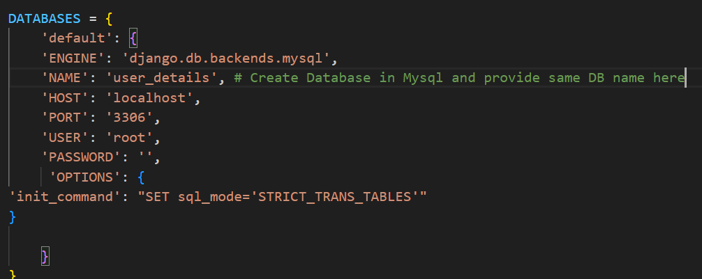
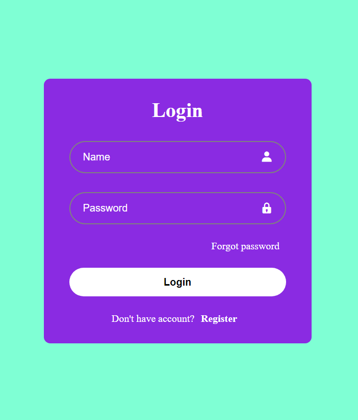
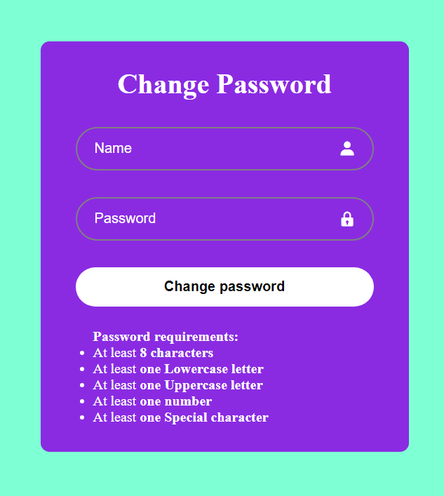
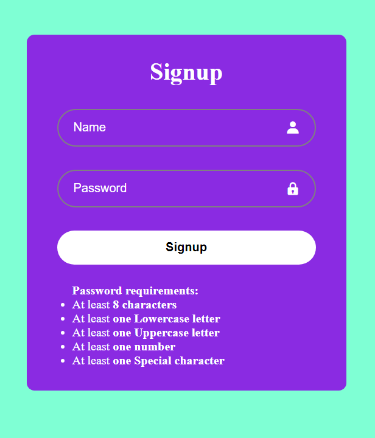

# Login App

A login app was created using Django HTML and MySql database for storage.

## Features

- Register new users
- Login with details
- Change password

## Run Locally

Clone this project

```bash
  git clone https://link-to-project
```

Go to the project directory

```bash
  cd my-project
```

Install dependencies

```bash
  pip install -r requirements.txt
```
Create migrations

```bash
  python manage.py makemigrations
```
Create a development database:

```bash
  python manage.py migrate
```

If everything is alright, you should be able to start the Django development server

```bash
  python manage.py runserver
```

## Usage

- Install XAMPP and start Apache and MySQL.
- If both are running then check for MySQL port number is same as PORT number in settings.py.
Next create Database in http://localhost/phpmyadmin/ and the name should be same in settings.py Databases NAME:""

  

- Then makemigrations and migrate, then refresh http://localhost/phpmyadmin/ page you should be able to see Database along with Table is created.
- Finally if table is created along the columns then at last you can run the `python manage.py runserver`.


## Screenshots






